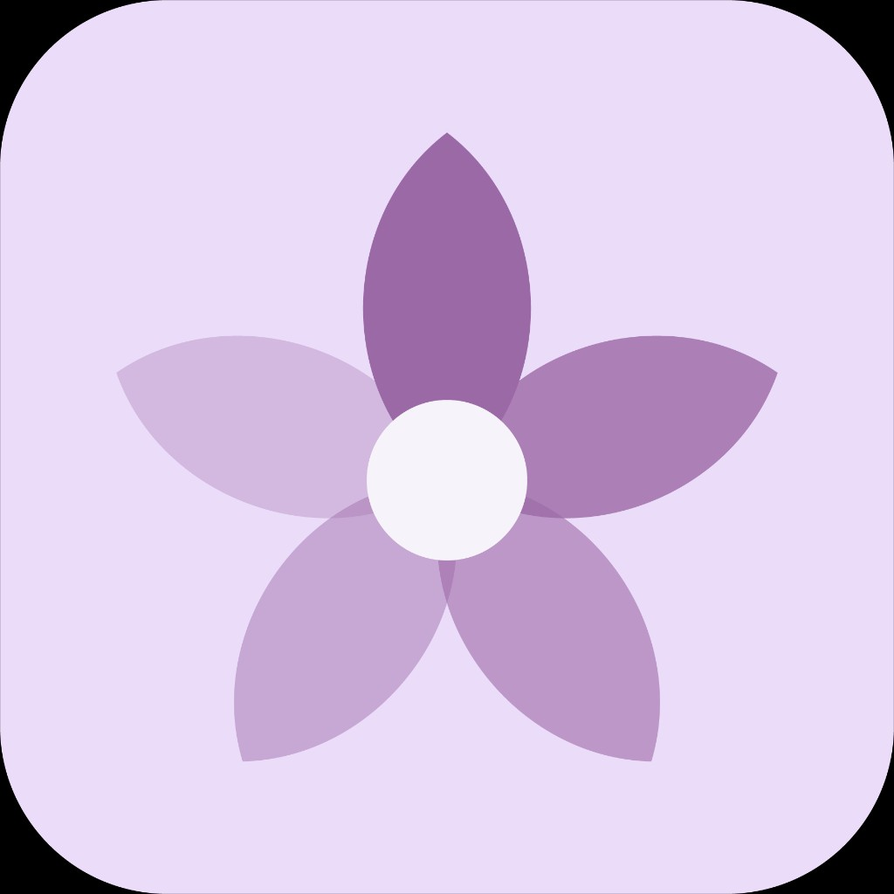

<p align="center">
  
</p>

<h1 align="center">Memora</h1>

Memora è un'applicazione multipiattaforma progettata per supportare pazienti affetti da Alzheimer, i loro familiari, caregiver e medici specialisti. Un ecosistema unificato che facilita la comunicazione, il monitoraggio dell'umore, la condivisione di ricordi e la gestione delle emergenze, il tutto con un'interfaccia accessibile, pulita e rassicurante.

## 🌟 Caratteristiche Principali

- **Ruoli Multipli (RBAC):** L'app adatta la sua interfaccia e le sue funzionalità in base al ruolo dell'utente:
  - 👴 **Paziente:** Interfaccia semplificata ad alta leggibilità, accesso rapido a chiamate di emergenza, galleria dei ricordi e chat con i propri cari.
  - 👨‍👩‍👧 **Familiare / Caregiver:** Monitoraggio dell'umore del paziente in tempo reale, gestione dell'agenda medica, ricezione di alert e condivisione di foto.
  - 🩺 **Medico:** Visione globale dell'andamento clinico (Analytics), report umore storicizzato, gestione sicura della cartella clinica e comunicazioni dirette con la rete di supporto.
  - 👑 **Super Admin:** Visione di tutto il sistema, simulazione dei ruoli per test, gestione completa degli utenti e dei permessi.
- **Diario e Memoriae (Social Feed):** Una bacheca condivisa, accessibile e sicura in cui familiari e pazienti possono caricare foto, ricordi testuali e messaggi vocali, per stimolare la funzione cognitiva.
- **Chat e Messaggistica (Testo & Vocale):** 
  - Chat pubbliche (gruppi familiari o gruppi di supporto).
  - Chat private tra medici e familiari, familiari e pazienti.
  - Supporto nativo ai **messaggi vocali** per pazienti che hanno difficoltà a digitare.
  - Interfaccia "a pillola" moderna e intuitiva, con animazioni fluide.
- **Monitoraggio Umore (Mood Tracker):** I pazienti o i caregiver possono aggiornare lo stato emotivo giornaliero (Felice, Normale, Triste). Il Medico può visualizzare un **Report Analytics** avanzato.
- **Pulsante SOS (Floating):** Accesso sempre visibile in tutte le pagine per chiamate rapide ai contatti di emergenza impostati, fondamentale per la sicurezza del paziente.
- **Supporto Accessibilità:** Testi grandi (`large-font-mode`), contrasti studiati appositamente per ipovedenti, UI con margini sicuri per evitare tocchi accidentali e transizioni "motion reduced" per evitare stress cognitivo.
- **Applicazione Ibrida (PWA / Mobile):** 
  - Web App responsiva, curata in ogni dettaglio sia su Desktop che Mobile.
  - Preparata per la compilazione nativa iOS e Android tramite **Capacitor**.

## 💻 Stack Tecnologico

Questo progetto è un'applicazione Single Page Application (SPA) reattiva, potenziata dalle moderne tecnologie del panorama frontend:

- **Core:** [React 18](https://reactjs.org/) + [Vite](https://vitejs.dev/) (per compilazione fulminea e HMR).
- **Styling:** CSS Vanilla avanzato (Variabili CSS globali, design system fluido, clamp(), media queries per desktop/mobile).
- **Routing:** React Router v6 per una navigazione dichiarativa sicura.
- **Animazioni:** [Framer Motion](https://www.framer.com/motion/) per le transizioni di pagina morbide ("page transition") che garantiscono continuità cognitiva.
- **State Management:** [Zustand](https://github.com/pmndrs/zustand) per la gestione fluida e scalabile dello stato (es. registrazione vocale, stato utente).
- **Backend & Database:** [Supabase](https://supabase.com/) per Autenticazione (Auth), Database PostgreSQL in Realtime e Storage dei media (audio/foto).
- **Mobile Native Wrapping:** [Capacitor](https://capacitorjs.com/) (Accesso a Geolocalizzazione, Haptics, Status Bar, ecc).
- **Data Visualization:** Recharts per le analitiche mediche.
- **Iconografia:** Lucide React.

## 🚀 Come avviare l'ambiente di sviluppo

1. **Clona la repository**
   ```bash
   git clone https://github.com/CosmoNetinfo/Memora.git
   cd Memora
   ```

2. **Installa le dipendenze**
   Assicurati di avere Node.js installato.
   ```bash
   npm install
   ```

3. **Configura le Variabili d'Ambiente**
   Crea un file `.env` nella root del progetto e aggiungi le chiavi Supabase fornite dal team:
   ```env
   VITE_SUPABASE_URL=il_tuo_supabase_url
   VITE_SUPABASE_ANON_KEY=la_tua_anon_key
   ```

4. **Avvia il server di sviluppo**
   ```bash
   npm run dev
   ```
   L'app sarà visibile all'indirizzo `http://localhost:5173`.

## 📱 Build e Deploy Mobile (Capacitor)

Il progetto è configurato per essere esportato come app nativa iOS e Android tramite Capacitor.

```bash
# Esegui la build del progetto web
npm run build

# Sincronizza i file web con le cartelle native
npm run cap:sync

# Apri Android Studio per compilare l'app
npm run android

# Apri Xcode per compilare l'app (solo su macOS)
npm run ios
```

## 🛠️ Contribuire (Developer Guidelines)

- **UI/UX Philosophy:** Qualsiasi componente aggiunto deve essere accessibile. Non usare ombre eccessive, usa le variabili di design preimpostate nel `index.css` (es. `var(--color-bg-primary)`, `var(--card-radius)`).
- **Responsive:** Lo sviluppo segue l'approccio mobile-first, ma la vista Desktop deve includere una `sidebar` permanente e margini generosi (`--desktop-gutter`). Controlla `index.css` sotto la media query `@media (min-width: 1024px)`.
- **Debug:** Esiste una Console di Debug mobile interna per catturare errori in ambiente nativo (utile per risolvere i log non visibili sui device senza ispezione USB).

## 📄 Licenza & Team

Sviluppata dal team **CosmoNetinfo** con la partecipazione del Web Designer **Michele** e del Developer **Daniele Spalletti**. 

Progetto riservato, tutti i diritti riservati.
